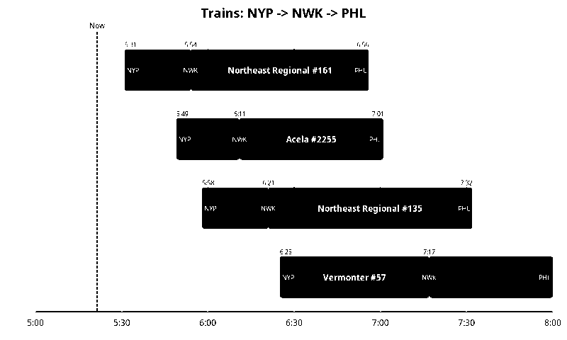

# amtrak-status

Query real-time Amtrak train schedules between stations and render them as
1-bit PNG images sized for e-ink displays (800x480).



## Quick start

Requires Python 3.11+ and [uv](https://docs.astral.sh/uv/).

```bash
uv sync                            # install dependencies
uv run main.py NYP NWK PHL         # fetch trains, writes trains_NYP_NWK_PHL.json
uv run visualize.py trains_NYP_NWK_PHL.json   # render to PNG
uv run server.py                   # start web server on :8080
```

## Project structure

```
main.py          Amtrak API client and train-finding logic
visualize.py     1-bit PNG renderer with bitmap font engine
server.py        HTTP server that combines the above two
departure.json   Bitmap font data (pixel definitions for each character)
deploy.sh        Deploys to production via SSH + systemd
```

## How it works

### Data pipeline

1. **Fetch** -- `main.py` hits the [Amtraker API](https://api-v3.amtraker.com/v3)
   to get every train serving the requested stations.
2. **Filter** -- For each train, check whether it stops at the requested stations
   in the correct order. Build "segments" for each consecutive station pair.
3. **Visualize** -- `visualize.py` takes the JSON output and renders a timeline
   where each train is a horizontal bar across a 3-hour window. Station codes,
   departure/arrival times, and route names are drawn with a custom bitmap font.

### Key data model

Trains are represented as a list of **segments** between consecutive requested
stations:

```json
{
  "train_id": "89-1",
  "train_num": "89",
  "route_name": "Palmetto",
  "status": "Active",
  "segments": [
    {
      "from": { "station_code": "NYP", "station_name": "New York Penn",
                "scheduled": "2026-02-01T06:02:00-05:00",
                "actual": "2026-02-01T06:02:00-05:00" },
      "to":   { "station_code": "NWK", "station_name": "Newark Penn",
                "scheduled": "2026-02-01T06:16:00-05:00",
                "actual": "2026-02-01T06:17:00-05:00" }
    }
  ]
}
```

The JSON files written by `main.py` wrap this in `{ "stations": [...], "trains": [...] }`.

## Modules in detail

### `main.py`

CLI entry point and API client. Core functions:

| Function | Purpose |
|---|---|
| `fetch_station(code)` | GET `/stations/{code}` -- returns station info with train IDs |
| `fetch_train(id)` | GET `/trains/{id}` -- returns full route with all stops |
| `find_connecting_trains(stations)` | Orchestrates the above, returns filtered train list |
| `build_json_output(trains, stations)` | Wraps results for JSON serialization |

`find_connecting_trains` is also imported by `server.py` -- it's the main
programmatic entry point for fetching data.

### `visualize.py`

Renders train data to an 800x480 1-bit PIL `Image`. Key constants:

```python
HOURS_TO_SHOW = 3        # time window displayed
WIDTH, HEIGHT = 800, 480 # image dimensions (e-ink target)
LEFT_MARGIN = 50
RIGHT_MARGIN = 40
FONT_SCALE = 2           # each font pixel becomes 2x2 screen pixels
```

The bitmap font is loaded from `departure.json` at module import time.
Missing characters (uppercase, `:`, `-`, `>`, `#`, space) are synthesized
in `load_font()`.

`create_image(trains, stations, now, buffer_before=0, buffer_after=0)` is the
main entry point, also imported by `server.py`. The optional buffer parameters
add checkerboard patterns before/after each train bar.

### `server.py`

Minimal HTTP server (stdlib `BaseHTTPRequestHandler`) on port 8080. Two URL
styles:

```
GET /trains?stations=NYP,NWK,PHL
GET /trains/NYP/NWK/PHL
```

Optional query params: `buffer_before` and `buffer_after` (minutes).

Train data is cached for 5 minutes (`CACHE_TTL`); the PNG is always regenerated
with the current time so the "now" line stays accurate.

## Deployment

`deploy.sh` pushes to a remote server over SSH:

```
ssh root@ares.io
  -> git pull (as trains user)
  -> uv sync
  -> copy trains.service to systemd
  -> systemctl restart trains
```

The service runs as the `trains` user under systemd.

## Dependencies

| Package | Used for |
|---|---|
| `httpx` | HTTP client for Amtrak API calls |
| `pillow` | Image creation and pixel manipulation |
| `cairosvg` | SVG-to-PNG conversion (currently unused, may be removed) |
| `svgwrite` | SVG generation (currently unused, may be removed) |
